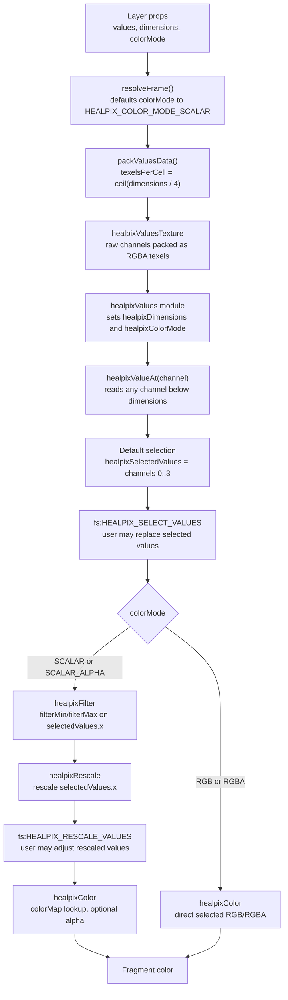

# HEALPix Cell Color Pipeline Implementation Plan

> **For agentic workers:** REQUIRED SUB-SKILL: Use superpowers:subagent-driven-development (recommended) or superpowers:executing-plans to implement this plan task-by-task. Steps use checkbox (`- [ ]`) syntax for tracking.

**Goal:** Build filtering, scalar rescaling, and color assignment as separate GPU shader modules composed through `HealpixCellsPrimitiveLayer.getShaders()`.

**Architecture:** `HealpixCellsPrimitiveLayer` owns the render pipeline. `dimensions` is the source value count per cell and drives values texture packing. `colorMode` controls how selected values are filtered, rescaled, and colored. The required `healpixValuesShaderModule` declares shared pipeline context, provides `healpixValueAt(channel)` for all packed source channels, and initializes `vec4 healpixSelectedValues`; stage modules inject code into `fs:DECKGL_FILTER_COLOR` and mutate selected values or the hook `color` parameter. User modules are passed through `shaderModules?: ShaderModule[]` and can inject into `fs:HEALPIX_SELECT_VALUES` or `fs:HEALPIX_RESCALE_VALUES`.



**Tech Stack:** TypeScript, deck.gl `Layer`, luma.gl shader modules, GLSL ES 3.00, Jest, React sandbox example.

---

## File Structure

- Modify `packages/deck.gl-healpix/src/types/layer-props.ts`: add `colorMode`, `filterMin/filterMax/rescaleMin/rescaleMax`, and root-level `shaderModules`.
- Modify `packages/deck.gl-healpix/src/utils/resolve-frame.ts`: resolve `colorMode` and range props with `min/max` compatibility fallback.
- Modify `packages/deck.gl-healpix/src/utils/resolve-frame.test.ts`: cover `colorMode` defaults, frame overrides, range defaults, and fallback.
- Modify `packages/deck.gl-healpix/src/utils/values-texture.ts`: pack `ceil(dimensions / 4)` texels per cell.
- Modify `packages/deck.gl-healpix/src/utils/values-texture.test.ts`: cover multi-texel cell packing.
- Modify `packages/deck.gl-healpix/src/layers/healpix-cells-layer.ts`: pass resolved pipeline props, forward `shaderModules`, and stop appending `HEALPIX_COLOR_EXTENSION`.
- Modify `packages/deck.gl-healpix/src/layers/healpix-cells-primitive-layer.ts`: register `healpixCellIndex`, compose built-in and user modules, bind `colorMode` and values packing props.
- Modify `packages/deck.gl-healpix/src/shaders/healpix-cells.vs.glsl.ts`: pass `healpixCellIndex` to the fragment shader.
- Keep `packages/deck.gl-healpix/src/shaders/healpix-cells.fs.glsl.ts` minimal: initialize `fragColor` and call `DECKGL_FILTER_COLOR`.
- Create `packages/deck.gl-healpix/src/shaders/healpix-values-shader-module.ts`: shared context, value accessor, default selected values, and selector hook.
- Create `packages/deck.gl-healpix/src/shaders/healpix-filter-shader-module.ts`: optional filter/discard stage injection.
- Create `packages/deck.gl-healpix/src/shaders/healpix-rescale-shader-module.ts`: optional scalar rescale stage injection plus rescale hook.
- Create `packages/deck.gl-healpix/src/shaders/healpix-color-shader-module.ts`: color assignment stage injection.
- Create `packages/deck.gl-healpix/src/shaders/healpix-color-pipeline.test.ts`: structure/order tests.
- Delete `packages/deck.gl-healpix/src/extensions/healpix-color-extension.ts`.
- Delete `packages/deck.gl-healpix/src/extensions/healpix-color-shader-module.ts`.
- Modify `examples/sandbox/app/pages/color/index.tsx`: use `rescaleMin/rescaleMax` and add scalar filter controls.

---

### Task 1: Resolve Color Mode, Filter, And Rescale Props

**Files:**
- Modify: `packages/deck.gl-healpix/src/types/layer-props.ts`
- Modify: `packages/deck.gl-healpix/src/utils/resolve-frame.ts`
- Test: `packages/deck.gl-healpix/src/utils/resolve-frame.test.ts`

- [ ] **Step 1: Add failing tests**

Add tests for the default scalar `colorMode`, explicit `colorMode`, default unbounded filtering, explicit root ranges, and frame overrides in `resolve-frame.test.ts`:

```ts
it('defaults filter range to unbounded and rescale range to min/max', () => {
  const result = resolveFrame(makeProps({ min: -2, max: 8 }));
  expect(result.filterMin).toBe(-Infinity);
  expect(result.filterMax).toBe(Infinity);
  expect(result.rescaleMin).toBe(-2);
  expect(result.rescaleMax).toBe(8);
});

it('uses explicit root filter and rescale ranges', () => {
  const result = resolveFrame(
    makeProps({
      filterMin: 0.2,
      filterMax: 0.9,
      rescaleMin: 0.1,
      rescaleMax: 1.2
    })
  );
  expect(result.filterMin).toBe(0.2);
  expect(result.filterMax).toBe(0.9);
  expect(result.rescaleMin).toBe(0.1);
  expect(result.rescaleMax).toBe(1.2);
});
```

- [ ] **Step 2: Run the focused test and verify it fails**

Run:

```bash
npm test --workspace @developmentseed/deck.gl-healpix -- src/utils/resolve-frame.test.ts
```

Expected: fails because the new properties are not typed or resolved yet.

- [ ] **Step 3: Add prop and resolved-frame types**

Define and export:

```ts
export const HEALPIX_COLOR_MODE_SCALAR = 1;
export const HEALPIX_COLOR_MODE_SCALAR_ALPHA = 2;
export const HEALPIX_COLOR_MODE_RGB = 3;
export const HEALPIX_COLOR_MODE_RGBA = 4;

export type HealpixColorMode =
  | typeof HEALPIX_COLOR_MODE_SCALAR
  | typeof HEALPIX_COLOR_MODE_SCALAR_ALPHA
  | typeof HEALPIX_COLOR_MODE_RGB
  | typeof HEALPIX_COLOR_MODE_RGBA;
```

Add to both public prop types:

```ts
  colorMode?: HealpixColorMode;
  filterMin?: number;
  filterMax?: number;
  rescaleMin?: number;
  rescaleMax?: number;
```

Add root-only `shaderModules` to `HealpixCellsLayerProps`:

```ts
  /** Custom shader modules appended after the built-in HEALPix color pipeline. */
  shaderModules?: ShaderModule[];
```

Import `ShaderModule` as a type from `@luma.gl/shadertools`.

Add `colorMode` as a required resolved field and add the range fields as required numbers to `ResolvedFrame`.

- [ ] **Step 4: Resolve values**

Add to the `resolveFrame()` returned object:

```ts
    colorMode:
      frame.colorMode ?? props.colorMode ?? HEALPIX_COLOR_MODE_SCALAR,
    filterMin: frame.filterMin ?? props.filterMin ?? -Infinity,
    filterMax: frame.filterMax ?? props.filterMax ?? Infinity,
    rescaleMin:
      frame.rescaleMin ?? props.rescaleMin ?? frame.min ?? props.min ?? 0,
    rescaleMax:
      frame.rescaleMax ?? props.rescaleMax ?? frame.max ?? props.max ?? 1,
```

- [ ] **Step 5: Run the focused test and verify it passes**

Run:

```bash
npm test --workspace @developmentseed/deck.gl-healpix -- src/utils/resolve-frame.test.ts
```

Expected: all tests in `resolve-frame.test.ts` pass.

---

### Task 2: Pack More Than Four Values Per Cell

**Files:**
- Modify: `packages/deck.gl-healpix/src/utils/values-texture.ts`
- Test: `packages/deck.gl-healpix/src/utils/values-texture.test.ts`

- [ ] **Step 1: Add failing packing tests**

Add tests that use `dimensions = 5` and assert that one cell occupies two RGBA texels, with the fifth value in the second texel's red channel. Also cover `dimensions = 10` to confirm `ceil(dimensions / 4)` texels per cell.

- [ ] **Step 2: Update packing metadata**

Return `texelsPerCell` from the values texture packing utility and compute:

```ts
const texelsPerCell = Math.ceil(dimensions / 4);
const texelCount = cellCount * texelsPerCell;
```

- [ ] **Step 3: Run values texture tests**

Run:

```bash
npm test --workspace @developmentseed/deck.gl-healpix -- src/utils/values-texture.test.ts
```

Expected: values texture tests pass.

---

### Task 3: Thread Color Mode, Ranges, And Packing To The Primitive Layer

**Files:**
- Modify: `packages/deck.gl-healpix/src/layers/healpix-cells-layer.ts`
- Modify: `packages/deck.gl-healpix/src/layers/healpix-cells-primitive-layer.ts`

- [ ] **Step 1: Stop appending the old color extension**

Remove the `HEALPIX_COLOR_EXTENSION` import and pass only user-provided extensions:

```ts
extensions: (this.props.extensions as LayerExtension[]) || []
```

- [ ] **Step 2: Pass resolved values and packing metadata to the primitive layer**

Pass:

```ts
uFilterMin: filterMin,
uFilterMax: filterMax,
uRescaleMin: rescaleMin,
uRescaleMax: rescaleMax,
uDimensions: dimensions,
uColorMode: colorMode,
uValuesWidth: valuesTextureWidth,
uTexelsPerCell: valuesTexelsPerCell,
shaderModules: this.props.shaderModules ?? [],
```

Remove old `uMin` and `uMax`.

- [ ] **Step 3: Add primitive pipeline prop type**

Add:

```ts
type HealpixColorPipelineProps = {
  valuesTexture: Texture;
  colorMapTexture: Texture;
  uFilterMin: number;
  uFilterMax: number;
  uRescaleMin: number;
  uRescaleMax: number;
  uDimensions: number;
  uColorMode: number;
  uValuesWidth: number;
  uTexelsPerCell: number;
  shaderModules: ShaderModule[];
};
```

Use it in `HealpixCellsPrimitiveLayerMergedProps`.

---

### Task 4: Add Injecting Shader Modules

**Files:**
- Create: `packages/deck.gl-healpix/src/shaders/healpix-values-shader-module.ts`
- Create: `packages/deck.gl-healpix/src/shaders/healpix-filter-shader-module.ts`
- Create: `packages/deck.gl-healpix/src/shaders/healpix-rescale-shader-module.ts`
- Create: `packages/deck.gl-healpix/src/shaders/healpix-color-shader-module.ts`

- [ ] **Step 1: Create the values module**

Create a module named `healpixValues` with `healpixValuesTexture`, `uDimensions`, `uColorMode`, `uValuesWidth`, and `uTexelsPerCell`. It declares color mode constants and the shared pipeline state:

```glsl
in float vHealpixCellIndex;

const int HEALPIX_COLOR_MODE_SCALAR = 1;
const int HEALPIX_COLOR_MODE_SCALAR_ALPHA = 2;
const int HEALPIX_COLOR_MODE_RGB = 3;
const int HEALPIX_COLOR_MODE_RGBA = 4;

struct HealpixPipelineState {
  int cell;
  int dimensions;
  int colorMode;
};

HealpixPipelineState healpixPipeline;
vec4 healpixSelectedValues;
```

It defines the low-level accessor `float healpixValueAt(int channel)`. The accessor computes `texel = channel / 4`, `component = channel % 4`, and reads from `cell * uTexelsPerCell + texel`. Its `inject['fs:DECKGL_FILTER_COLOR']` initializes `healpixPipeline.cell`, `dimensions`, `colorMode`, and `healpixSelectedValues` from the first four selected values according to `dimensions`, then calls:

```glsl
HEALPIX_SELECT_VALUES(healpixSelectedValues, geometry);
```

`HEALPIX_SELECT_VALUES` is a user hook. By default it does nothing. User shader modules can inject into it to rewrite `healpixSelectedValues`, call `healpixValueAt(channel)`, and discard fragments before built-in filtering.

- [ ] **Step 2: Create the filter module**

Create a module named `healpixFilter` with `uFilterMin/uFilterMax`. Its injection reads `healpixSelectedValues.x` and calls `discard` when `colorMode` is `HEALPIX_COLOR_MODE_SCALAR` or `HEALPIX_COLOR_MODE_SCALAR_ALPHA` and the selected value is outside range.

- [ ] **Step 3: Create the rescale module**

Create a module named `healpixRescale` with `uRescaleMin/uRescaleMax`. Its injection overwrites `healpixSelectedValues.x` with the rescaled value for scalar color modes, then calls:

```glsl
HEALPIX_RESCALE_VALUES(healpixSelectedValues, geometry);
```

`HEALPIX_RESCALE_VALUES` is a user hook. By default it does nothing. User shader modules can inject into it to apply custom nonlinear or multi-channel rescaling.

- [ ] **Step 4: Create the color module**

Create a module named `healpixColor` with `healpixColorMapTexture`. Its injection assigns the hook `color` parameter according to `colorMode`, using `healpixSelectedValues`, and applies `layer.opacity`.

Register `HEALPIX_SELECT_VALUES` and `HEALPIX_RESCALE_VALUES` on `context.shaderAssembler` before creating the model. Do not define public stage functions such as `healpixApplyColor()` or make the fragment shader call stage functions. `healpixValueAt(channel)` is allowed because it is the values module's accessor primitive, not a stage invocation.

---

### Task 5: Compose Modules In The Primitive Layer

**Files:**
- Modify: `packages/deck.gl-healpix/src/layers/healpix-cells-primitive-layer.ts`
- Modify: `packages/deck.gl-healpix/src/shaders/healpix-cells.vs.glsl.ts`
- Modify: `packages/deck.gl-healpix/src/shaders/healpix-cells.fs.glsl.ts`
- Test: `packages/deck.gl-healpix/src/shaders/healpix-color-pipeline.test.ts`

- [ ] **Step 1: Add shader structure tests**

Tests should assert that each stage module injects into `fs:DECKGL_FILTER_COLOR`, that the fragment shader does not call stage functions, that `healpixValueAt` and `healpixSelectedValues` exist in the values module, that the selector/rescale hooks are present, that `this.props.shaderModules` is appended after built-in modules, and that removing the filter module would not leave an unresolved filter function call.

- [ ] **Step 2: Register `healpixCellIndex`**

Register `healpixCellIndex` in `HealpixCellsPrimitiveLayer.initializeState()` alongside `cellIdLo` and `cellIdHi`.

- [ ] **Step 3: Compose modules in dependency order**

Use:

```ts
modules: [
  project32,
  picking,
  healpixCellsShaderModule,
  healpixValuesShaderModule,
  healpixFilterShaderModule,
  healpixRescaleShaderModule,
  healpixColorShaderModule,
  ...this.props.shaderModules
]
```

- [ ] **Step 4: Pass cell index to the fragment shader**

Add `in float healpixCellIndex;` and `out float vHealpixCellIndex;` in the vertex shader and assign:

```glsl
vHealpixCellIndex = healpixCellIndex;
```

- [ ] **Step 5: Keep the fragment shader as hook host**

Keep fragment `main()` minimal:

```glsl
void main() {
  fragColor = vColor;
  DECKGL_FILTER_COLOR(fragColor, geometry);
}
```

- [ ] **Step 6: Bind shader inputs in `draw()`**

Set props for `healpixValues`, `healpixFilter`, `healpixRescale`, and `healpixColor` through `model.shaderInputs.setProps()`.

- [ ] **Step 7: Run focused tests and typecheck**

Run:

```bash
npm test --workspace @developmentseed/deck.gl-healpix -- src/shaders/healpix-color-pipeline.test.ts src/utils/resolve-frame.test.ts
npm run ts-check --workspace @developmentseed/deck.gl-healpix
```

Expected: both commands pass.

---

### Task 6: Remove The Old Color Extension

**Files:**
- Delete: `packages/deck.gl-healpix/src/extensions/healpix-color-extension.ts`
- Delete: `packages/deck.gl-healpix/src/extensions/healpix-color-shader-module.ts`
- Modify: `packages/deck.gl-healpix/src/index.ts`

- [ ] **Step 1: Check for stale imports**

Run:

```bash
rg "healpix-color|HealpixColor|HEALPIX_COLOR" packages/deck.gl-healpix/src
```

Expected: only old extension files and stale public exports match.

- [ ] **Step 2: Delete stale files and exports**

Delete the old extension files and remove any color-extension exports from `index.ts`.

- [ ] **Step 3: Run typecheck**

Run:

```bash
npm run ts-check --workspace @developmentseed/deck.gl-healpix
```

Expected: passes.

---

### Task 7: Update The Sandbox Smoke Controls

**Files:**
- Modify: `examples/sandbox/app/pages/color/index.tsx`

- [ ] **Step 1: Rename scalar range state**

Replace `indexMin/indexMax` with `rescaleMin/rescaleMax` and add `filterMin/filterMax`.

- [ ] **Step 2: Pass new props to scalar layers**

For NDVI and single-band layers, pass:

```ts
rescaleMin,
rescaleMax,
filterMin,
filterMax,
```

- [ ] **Step 3: Add filter smoke control**

Add a second scalar-only slider labelled `Visibility filter`. It updates `filterMin/filterMax`; the existing slider updates `rescaleMin/rescaleMax`.

- [ ] **Step 4: Run package verification**

Run:

```bash
npm test --workspace @developmentseed/deck.gl-healpix
npm run ts-check --workspace @developmentseed/deck.gl-healpix
npm run build --workspace @developmentseed/deck.gl-healpix
```

Expected: all commands pass.

---

### Task 8: Manual Smoke Test

**Files:**
- No edits unless verification reveals a problem.

- [ ] **Step 1: Verify scalar filtering**

Run the sandbox color page, choose `NDVI`, set a narrow visibility filter, and confirm cells outside the range disappear rather than becoming transparent.

- [ ] **Step 2: Verify rescale independence**

Keep the filter range fixed, change the rescale range, and confirm colors change while the visible set remains the same.

- [ ] **Step 3: Verify direct RGB modes**

Choose `True color` or another RGB composite and confirm filter/rescale controls do not affect direct RGB rendering.