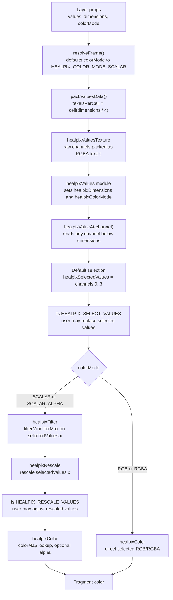

# HEALPix Cell Color Pipeline - Design Spec

**Date:** 2026-04-28
**Branch:** `feature/healpix-sentinel-process`
**Status:** Approved

---

## Overview

Refactor the `HealpixCellsLayer` color path into a small GPU pipeline that keeps the existing cell calculation intact while making filtering, rescaling, and coloring explicit stages.

The current implementation isolates color work in one `HealpixColorExtension` block injected into the vertex shader. The new design removes that single color extension from the core pipeline and composes several luma/deck shader modules directly in `HealpixCellsPrimitiveLayer.getShaders()`. User-provided modules can be appended through a `shaderModules` prop.

```ts
modules: [
  project32,
  picking,
  healpixCellsShaderModule,
  healpixValuesShaderModule,
  healpixFilterShaderModule,
  healpixRescaleShaderModule,
  healpixColorShaderModule
]
```

The fragment shader invokes those modules in order:

```
cell reference
  -> selected values vec4
  -> custom value selector hook
  -> immediate filter/discard
  -> rescale selected scalar
  -> custom rescale hook
  -> color variable
  -> deck.gl opacity/picking hooks
```

This makes the GPU pipeline explicit without asking users to manually compose deck.gl extensions. Each built-in shader module owns one stage, and user modules can target the public hook points.

---

## Goals

- Keep HEALPix cell decode/corner calculation unchanged.
- Filter cells by their first value before final fragment output.
- Discard filtered cells completely, including picking output.
- Rescale scalar values independently from the filter range.
- Use `dimensions` only for the number of source values stored per cell.
- Use `colorMode` to control how selected values are filtered, rescaled, and colored.
- Allow `healpixValueAt(channel)` to address source channels beyond `0..3`.

## Non-goals

- Implement built-in band math presets in this change.
- Split the public API into multiple user-facing extensions.
- Keep `HealpixColorExtension` as the internal color-pipeline owner.
- Change HEALPix geometry, NEST/RING decode, or corner precision.

---

## Public API

Add explicit filter and rescale ranges to both root layer props and frame objects:

```ts
export const HEALPIX_COLOR_MODE_SCALAR = 1;
export const HEALPIX_COLOR_MODE_SCALAR_ALPHA = 2;
export const HEALPIX_COLOR_MODE_RGB = 3;
export const HEALPIX_COLOR_MODE_RGBA = 4;

export type HealpixColorMode =
  | typeof HEALPIX_COLOR_MODE_SCALAR
  | typeof HEALPIX_COLOR_MODE_SCALAR_ALPHA
  | typeof HEALPIX_COLOR_MODE_RGB
  | typeof HEALPIX_COLOR_MODE_RGBA;

type HealpixFrameObject = {
  // existing fields...
  colorMode?: HealpixColorMode
  filterMin?: number
  filterMax?: number
  rescaleMin?: number
  rescaleMax?: number
}

type HealpixCellsLayerProps = {
  // existing fields...
  colorMode?: HealpixColorMode
  filterMin?: number
  filterMax?: number
  rescaleMin?: number
  rescaleMax?: number
  shaderModules?: ShaderModule[]
} & CompositeLayerProps
```

`shaderModules` is a root-level layer prop, not a frame prop. It appends custom luma shader modules to the primitive layer after the built-in pipeline modules. Custom modules can inject into the public hooks registered by the primitive layer:

```ts
inject: {
  'fs:HEALPIX_SELECT_VALUES': `...`,
  'fs:HEALPIX_RESCALE_VALUES': `...`
}
```

Defaults:

```ts
colorMode = HEALPIX_COLOR_MODE_SCALAR
filterMin = -Infinity
filterMax = Infinity
rescaleMin = min ?? 0
rescaleMax = max ?? 1
```

`min` and `max` stay as compatibility aliases for the scalar color range, but the clearer names are `rescaleMin` and `rescaleMax`. New code should use the rescale props. `colorMode` does not infer from `dimensions`; callers must set it explicitly with the exported integer constants for scalar-alpha, RGB, or RGBA rendering.

### Custom Selector Example

```ts
const ndviSelectorModule = {
  name: 'ndviSelector',
  inject: {
    'fs:HEALPIX_SELECT_VALUES': `\
float nir = healpixValueAt(7);
float red = healpixValueAt(3);
float denom = max(nir + red, 1e-6);
float ndvi = (nir - red) / denom;

if (ndvi < 0.2) {
  discard;
}

healpixSelectedValues = vec4(ndvi, 0.0, 0.0, 0.0);
`
  }
};

new HealpixCellsLayer({
  id: 'ndvi',
  nside,
  cellIds,
  values,
  dimensions: bandCount,
  colorMode: HEALPIX_COLOR_MODE_SCALAR,
  rescaleMin: -1,
  rescaleMax: 1,
  shaderModules: [ndviSelectorModule]
});
```

### Custom Rescale Example

```ts
const gammaRescaleModule = {
  name: 'gammaRescale',
  inject: {
    'fs:HEALPIX_RESCALE_VALUES': `\
healpixSelectedValues.x = pow(healpixSelectedValues.x, 0.5);
`
  }
};
```

Frame resolution follows the existing root-defaults/frame-overrides model:

```
effectiveFrame = {
  // existing fields...
  colorMode: frame.colorMode ?? props.colorMode ?? HEALPIX_COLOR_MODE_SCALAR,
  filterMin:  frame.filterMin  ?? props.filterMin  ?? -Infinity,
  filterMax:  frame.filterMax  ?? props.filterMax  ?? Infinity,
  rescaleMin: frame.rescaleMin ?? props.rescaleMin ?? frame.min ?? props.min ?? 0,
  rescaleMax: frame.rescaleMax ?? props.rescaleMax ?? frame.max ?? props.max ?? 1,
}
```

---

## Dimensions And Color Mode Behavior

`dimensions` is the number of source values stored per cell. It controls value texture packing and the valid channel range for `healpixValueAt(channel)`.

`colorMode` controls how `healpixSelectedValues` is interpreted after the selector hook runs.



### `colorMode = HEALPIX_COLOR_MODE_SCALAR`

```
valueAt(0)
  -> filterMin/filterMax visibility gate
  -> normalize through rescaleMin/rescaleMax
  -> colorMap lookup
```

### `colorMode = HEALPIX_COLOR_MODE_SCALAR_ALPHA`

```
valueAt(0)
  -> filterMin/filterMax visibility gate
  -> normalize through rescaleMin/rescaleMax
  -> colorMap lookup

valueAt(1)
  -> alpha multiplier
```

### `colorMode = HEALPIX_COLOR_MODE_RGB`

No filter or rescale. Values are direct RGB:

```
vec4(valueAt(0), valueAt(1), valueAt(2), 1.0)
```

### `colorMode = HEALPIX_COLOR_MODE_RGBA`

No filter or rescale. Values are direct RGBA:

```
vec4(valueAt(0), valueAt(1), valueAt(2), valueAt(3))
```

Invalid or unsupported `colorMode` values keep fail-soft behavior: render transparent rather than throwing during draw.

---

## Shader Architecture

Use several shader modules passed to `getShaders({ modules })`. The primitive layer owns the pipeline assembly and draw-time shader inputs. Modules act by injecting code into shader hook points, not by defining public functions that the final shader must call.

```ts
getShaders(): ReturnType<Layer['getShaders']> {
  return super.getShaders({
    vs: HEALPIX_VERTEX_SHADER,
    fs: HEALPIX_FRAGMENT_SHADER,
    modules: [
      project32,
      picking,
      healpixCellsShaderModule,
      healpixValuesShaderModule,
      healpixFilterShaderModule,
      healpixRescaleShaderModule,
      healpixColorShaderModule,
      ...this.props.shaderModules
    ]
  });
}
```

The fragment shader should stay small. It should not call stage functions such as filtering, rescaling, or color application directly. Instead it exposes a deck.gl color hook, and modules inject their stage code into that hook:

```glsl
void main() {
  fragColor = vColor;
  DECKGL_FILTER_COLOR(fragColor, geometry);
}
```

The shared state is a selected `vec4` plus small metadata declared by the required values module. Optional stage modules mutate `healpixSelectedValues` or `color` inside the hook. Removing `healpixFilterShaderModule` removes filtering and should not break compilation.

### `healpixValuesShaderModule`

Responsible for shared pipeline context, raw value access, and default selected-value loading. No new texture is created per cell; the texture is the existing uploaded `healpixValuesTexture`.

This module provides `healpixValueAt(channel)` as the low-level value accessor. That accessor is different from a stage function: the base fragment shader does not call it, and removing an optional stage such as filtering does not leave an unresolved call. Stages that need values can call `healpixValueAt()`.

The module also declares the working value used by downstream modules:

```glsl
vec4 healpixSelectedValues;
```

Declarations:

```glsl
const int HEALPIX_COLOR_MODE_SCALAR = 1;
const int HEALPIX_COLOR_MODE_SCALAR_ALPHA = 2;
const int HEALPIX_COLOR_MODE_RGB = 3;
const int HEALPIX_COLOR_MODE_RGBA = 4;

struct HealpixPipelineState {
  int cell;
  int dimensions;
  int colorMode;
};

HealpixPipelineState healpixPipeline;
vec4 healpixSelectedValues;

float healpixValueAt(int channel) {
  int texel = channel / 4;
  int component = channel - texel * 4;

  int valueIndex = healpixPipeline.cell * healpixValues.uTexelsPerCell + texel;
  int x = valueIndex % healpixValues.uValuesWidth;
  int y = valueIndex / healpixValues.uValuesWidth;
  vec4 rgba = texelFetch(healpixValuesTexture, ivec2(x, y), 0);

  if (component == 0) return rgba.r;
  if (component == 1) return rgba.g;
  if (component == 2) return rgba.b;
  if (component == 3) return rgba.a;
  return 0.0;
}
```

`uTexelsPerCell = ceil(dimensions / 4)`, so `healpixValueAt(channel)` can address any source value channel packed into the texture. Channels outside the declared `dimensions` range return `0.0`.

Hook injection:

```glsl
healpixPipeline.cell = int(vHealpixCellIndex + 0.5);
healpixPipeline.dimensions = healpixValues.uDimensions;
healpixPipeline.colorMode = healpixValues.uColorMode;
healpixSelectedValues = vec4(
  healpixValueAt(0),
  healpixPipeline.dimensions > 1 ? healpixValueAt(1) : 0.0,
  healpixPipeline.dimensions > 2 ? healpixValueAt(2) : 0.0,
  healpixPipeline.dimensions > 3 ? healpixValueAt(3) : 0.0
);
```

`HEALPIX_SELECT_VALUES` is a user hook. By default it does nothing. A user module passed through `shaderModules` may inject into this hook to rewrite `healpixSelectedValues` using `healpixValueAt(channel)` and may call `discard` for custom filtering before the built-in filter stage runs.

Module-owned inputs:

- `healpixValuesTexture`
- `uDimensions`
- `uColorMode`
- `uValuesWidth`
- `uTexelsPerCell`

### `healpixFilterShaderModule`

Responsible for the visibility gate. It acts on the shared pipeline context and discards immediately when the cell is outside the filter range:

```glsl
if (
  healpixPipeline.colorMode == HEALPIX_COLOR_MODE_SCALAR ||
  healpixPipeline.colorMode == HEALPIX_COLOR_MODE_SCALAR_ALPHA
) {
  float v = healpixSelectedValues.x;
  if (v < healpixFilter.uFilterMin || v > healpixFilter.uFilterMax) {
    discard;
  }
}
```

There is no stored `visible` state. A rejected fragment exits the pipeline at this stage.

Module-owned inputs:

- `uFilterMin`
- `uFilterMax`

### `healpixRescaleShaderModule`

Responsible for scalar normalization. It overwrites `healpixSelectedValues.x` with the rescaled value for scalar color modes. For RGB and RGBA color modes, the color stage uses `healpixSelectedValues` directly.

```glsl
if (
  healpixPipeline.colorMode == HEALPIX_COLOR_MODE_SCALAR ||
  healpixPipeline.colorMode == HEALPIX_COLOR_MODE_SCALAR_ALPHA
) {
  float value = healpixSelectedValues.x;
  float denom = healpixRescale.uRescaleMax - healpixRescale.uRescaleMin;
  healpixSelectedValues.x = denom == 0.0
    ? 0.0
    : clamp((value - healpixRescale.uRescaleMin) / denom, 0.0, 1.0);
}
```

This preserves the current zero-width-range behavior.

`HEALPIX_RESCALE_VALUES` is a user hook. By default it does nothing. A user module passed through `shaderModules` may inject into it to apply nonlinear stretches or multi-channel rescaling after the built-in rescale stage.

Module-owned inputs:

- `uRescaleMin`
- `uRescaleMax`

### `healpixColorShaderModule`

Responsible for assigning the `color` hook parameter:

```glsl
if (healpixPipeline.colorMode == HEALPIX_COLOR_MODE_SCALAR) {
  color = texelFetch(
    healpixColorMapTexture,
    ivec2(int(healpixSelectedValues.x * 255.0), 0),
    0
  );
} else if (healpixPipeline.colorMode == HEALPIX_COLOR_MODE_SCALAR_ALPHA) {
  color = texelFetch(
    healpixColorMapTexture,
    ivec2(int(healpixSelectedValues.x * 255.0), 0),
    0
  );
  color.a *= healpixSelectedValues.y;
} else if (healpixPipeline.colorMode == HEALPIX_COLOR_MODE_RGB) {
  color = vec4(healpixSelectedValues.rgb, 1.0);
} else if (healpixPipeline.colorMode == HEALPIX_COLOR_MODE_RGBA) {
  color = healpixSelectedValues;
} else {
  color = vec4(0.0);
}
```

Module-owned inputs:

- `healpixColorMapTexture`

### Module Independence And Order

The modules are listed in execution order:

```
healpixValues
healpixFilter
healpixRescale
healpixColor
```

`healpixValuesShaderModule` is required for the built-in value-driven color pipeline. The remaining stage modules should be removable when their behavior is not desired:

- Remove `healpixFilterShaderModule`: no filtering happens, and compilation still succeeds.
- Remove `healpixRescaleShaderModule`: `healpixSelectedValues.x` remains the selected first value, so scalar color uses the selected raw value as the colorMap coordinate.
- Remove `healpixColorShaderModule`: the shader keeps whatever color was set before the hook.

Keep the order explicit in `HealpixCellsPrimitiveLayer.getShaders()` and cover it with shader structure tests. Do not rely on implicit extension ordering for the built-in pipeline.

---

## Vertex vs Fragment Responsibilities

The current color extension injects into `vs:DECKGL_FILTER_COLOR`, so color is computed in the vertex shader and interpolated across each cell quad. That works today because every vertex of a cell reads the same cell value, producing a solid color.

The new filter requirement changes the stage split. GLSL `discard` is only valid in fragment shaders, so a vertex shader cannot truly remove a cell. It can only output transparent color or move geometry away, neither of which is the desired behavior.

New stage responsibilities:

```
vertex shader:
  decode HEALPix cell
  position quad corners
  pass healpixCellIndex to the fragment shader

fragment shader:
  create value accessor for the cell
  discard if the scalar filter rejects the cell
  rescale scalar values
  compute final color
  apply layer opacity and deck.gl output hooks
```

This means values are fetched per fragment instead of per vertex. For this layer, the cost is acceptable because it gives correct discard semantics, keeps filter/rescale/color in one place, and avoids passing a fixed set of value varyings that would get in the way of future `dimensions > 4` support.

---

## Layer and Module Wiring

`HealpixColorExtension` should no longer be appended by `HealpixCellsLayer` for the built-in color path. The primitive layer owns the color pipeline because the modules are part of the layer's base shaders. `HealpixCellsLayer` forwards `shaderModules` to the primitive layer.

### Attributes

Move `healpixCellIndex` registration into `HealpixCellsPrimitiveLayer.initializeState()` next to `cellIdLo` and `cellIdHi`:

```ts
healpixCellIndex: {
  size: 1,
  type: 'float32',
  stepMode: 'instance',
  accessor: 'healpixCellIndex',
  defaultValue: 0,
  noAlloc: true
}
```

The vertex shader declares:

```glsl
in float healpixCellIndex;
out float vHealpixCellIndex;
```

and assigns:

```glsl
vHealpixCellIndex = healpixCellIndex;
```

### Shader inputs

`HealpixCellsPrimitiveLayer.draw()` sets props for each module:

```ts
model.shaderInputs.setProps({
  healpixCells: computeHealpixCellsUniforms(this.props.nside, this.props.scheme),
  healpixValues: {
    uDimensions,
    uColorMode,
    uValuesWidth,
    uTexelsPerCell,
    healpixValuesTexture: valuesTexture
  },
  healpixFilter: {
    uFilterMin,
    uFilterMax
  },
  healpixRescale: {
    uRescaleMin,
    uRescaleMax
  },
  healpixColor: {
    healpixColorMapTexture: colorMapTexture
  }
});
```

### User Module Ordering

`shaderModules` are appended after the built-in modules in `getShaders()`. Their injections target public hook names registered on deck's shader assembler by `HealpixCellsPrimitiveLayer`:

- `fs:HEALPIX_SELECT_VALUES` is called inside `healpixValuesShaderModule`, after default selected values are loaded and before built-in filtering.
- `fs:HEALPIX_RESCALE_VALUES` is called inside `healpixRescaleShaderModule`, after built-in scalar rescaling and before coloring.

This lets user modules customize selection/rescale behavior without replacing the whole pipeline.

`uMin` and `uMax` can remain public compatibility aliases only at the frame-resolution layer. The shader modules should use `uRescaleMin` and `uRescaleMax`.

---

## Picking Behavior

Filtered cells must be discarded completely. The discard should run in the fragment shader before final color output in both normal and picking passes.

The implementation must preserve deck.gl's picking machinery. The extension should not bypass picking color output; it should only discard rejected fragments before deck.gl writes final pass-specific output.

Acceptance criterion: a filtered-out cell is not visible and cannot be picked.

---

## Testing

### Unit tests

- `resolve-frame.test.ts`
  - root defaults for `filterMin/filterMax/rescaleMin/rescaleMax`
  - frame overrides for each new range prop
  - `rescaleMin/rescaleMax` fallback to existing `min/max`

- `values-texture.test.ts`
  - current packing still supports channels `0..3`
  - value-accessor assumptions are documented by tests even though the accessor itself is GLSL

### Shader structure tests

Add tests that assert shader/module strings and shader assembly contain the required pieces:

- each stage module injects into `fs:DECKGL_FILTER_COLOR`
- `healpixFilterShaderModule` contains fragment-stage `discard`
- `healpixColorShaderModule` assigns the hook `color` parameter
- `HealpixCellsPrimitiveLayer.getShaders()` includes modules in the intended order
- the fragment shader stays a hook host and does not call stage functions directly

These tests do not prove GPU output, but they catch accidental regression back to one inline vertex-color block or a function-calling pipeline.

### Manual smoke test

Update or add a sandbox color example with a visible filter window:

- `colorMode = HEALPIX_COLOR_MODE_SCALAR`: cells outside `filterMin/filterMax` disappear
- `colorMode = HEALPIX_COLOR_MODE_SCALAR_ALPHA`: same visibility behavior, with selected channel `1` still affecting alpha
- picking a filtered-out cell returns nothing
- changing `rescaleMin/rescaleMax` changes colors without changing visibility

---

## Risks

| Risk | Mitigation |
|---|---|
| Fragment-stage value fetch costs more than vertex-stage fetch | Accept for correctness first; profile later if large cells/fill rate become a problem. |
| Deck.gl picking hooks conflict with custom fragment output | Keep `DECKGL_FILTER_COLOR(fragColor, geometry)` in the fragment shader after module color assignment and verify both render and picking passes manually. |
| `Infinity` uniforms behave inconsistently across backends | If needed, map unbounded filter defaults to large finite sentinels before uniform upload. |
| Multi-texel value layout leaks into filter/color code | Keep texture-layout knowledge inside `healpixValueAt()` and pass only selected values plus `colorMode` downstream. |
| Shader module ordering becomes implicit | Keep the module list in dependency order in `getShaders()` and add tests that assert the order. |

---

## Implementation Outline

1. Extend layer and frame props with `colorMode` and filter/rescale ranges.
2. Update frame resolution defaults and tests.
3. Move `healpixCellIndex` ownership from `HealpixColorExtension` into `HealpixCellsPrimitiveLayer`.
4. Update value texture packing so `dimensions` can exceed four values per cell.
5. Add `healpix-values`, `healpix-filter`, `healpix-rescale`, and `healpix-color` shader modules.
6. Compose those modules in `HealpixCellsPrimitiveLayer.getShaders()`.
7. Update the fragment shader to invoke the module pipeline in order.
8. Bind each module's uniforms/textures from `HealpixCellsPrimitiveLayer.draw()`.
9. Remove the built-in dependency on `HealpixColorExtension`.
10. Add shader structure/order tests.
11. Update the sandbox color example for filter/rescale smoke testing.
